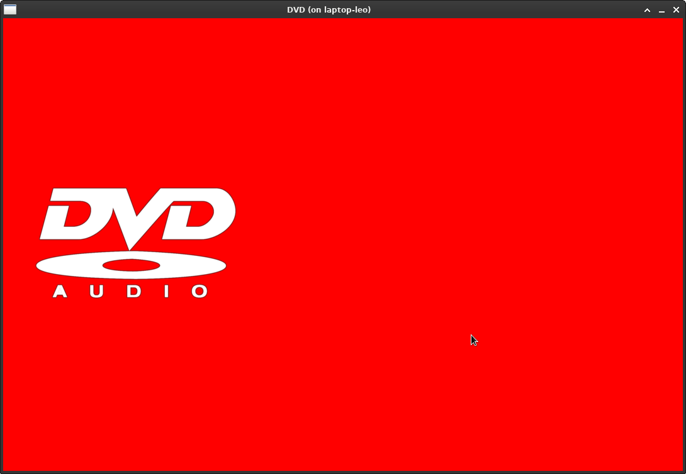

# DVD

## Goal of the project
The goal of the project is to make a duo project just after first part of cpool at Epitech. The project was created with @Just1Truc. The project is to re-create the dvd animation whe no disc is inserted in C with CSFML library. Too add a personnal touch. It's not the logo that changes color each time it touches an adge of the window but the background.

## Other details
This project was completed in 2 days and complies with the ***Coding Style*** rules imposed by Epitech

## Images

## Installation
To test this project, you can just clone or download this repository and use the make command to run our Makefile then run this command: ``*./dvd*``. Of course, make sure you have installed the CSFML library on your PC.
